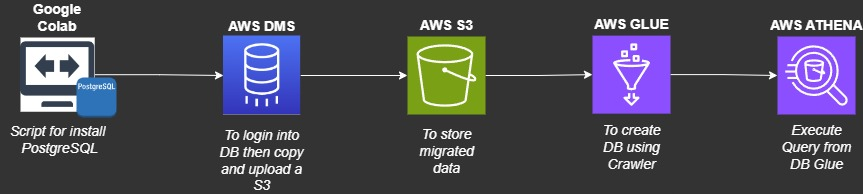

# AWS-DataMigrationSportstickets

## Steps
- [Introduction](##Introduction)
- [Setup](##Setup)
- [Architecture-Diagram](##Architecture-Diagram)

## Introduction
In this lab is a data pipeline how to migrate data from PostGreSQL using AWS Data Migration Service with destionation S3, then we'll apply AWS Glue and AWS Athena
to check the data migrated.

Google Colab: Use the script (Script_Postgresql.ipynb) to create and configure PostgreSQL.
AWS DMS: Utilized for migrating data from PostgreSQL to S3.
AWS S3 bucket: This bucket will be used to store data.
AWS Glue: Employed to create a table using the Crawler.
AWS Athena: Used for performance queries and data verification.
  
## Setup

## Architecture-Diagram

